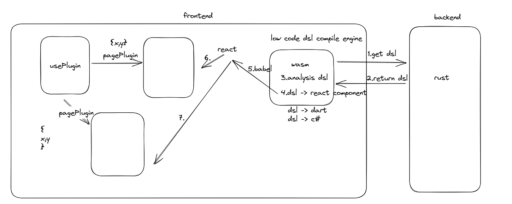
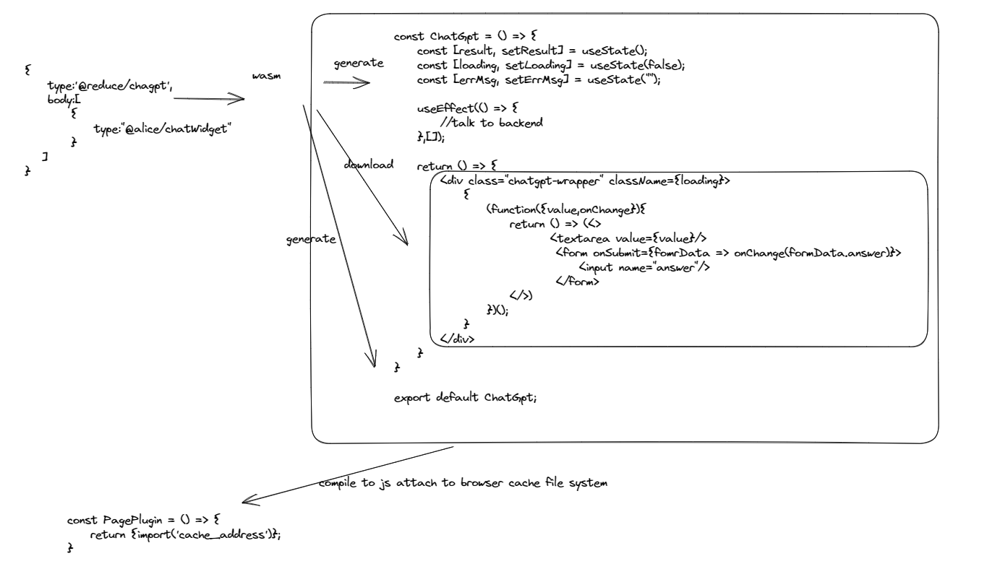

# reduce plugin system based on wasm.

## how does it works

plugin structure like this:

reduce plugin system support three different platform frontend: web, flutter, vr.

different platform need different render tech, rps(reduce plugin system) does not need to build three parts of these platforms,

it put plugin devide two parts: service component, ui component.

service component fetch data, and trans it to ui component.

service component is dsl(domain sepecial language) describe, in rps is json.

ui component is these platform's tech to build, in web is js(react), in flutter is dart, in vr is c#.

as web platform for detail:

as you can see, rps have wasm and react.

so wasm is called compiler engine.

react as wasm's render engine.

wasm get dsl from backend server, and compile it to react component,
then send it to react to render.

more detail below:

## config file

- rps.toml
  reduce plugin system's config file
- rsw.toml
  wasm generate's config file

